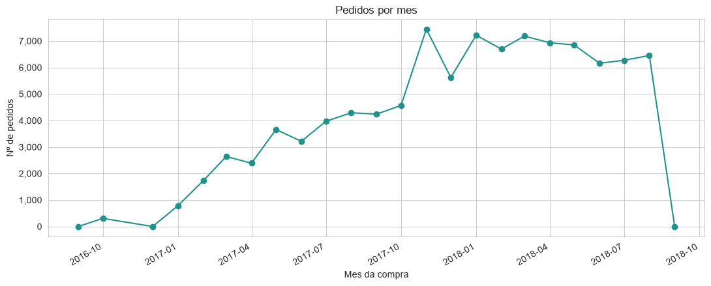
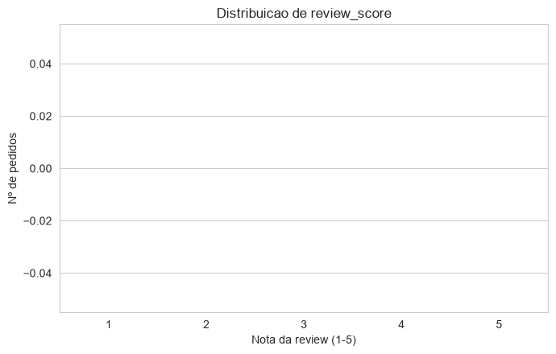
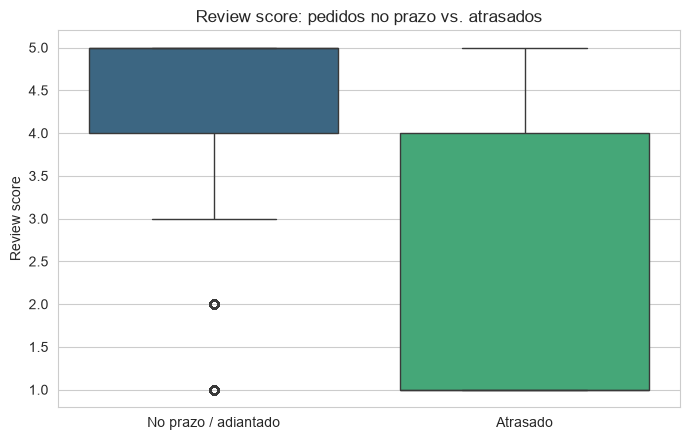
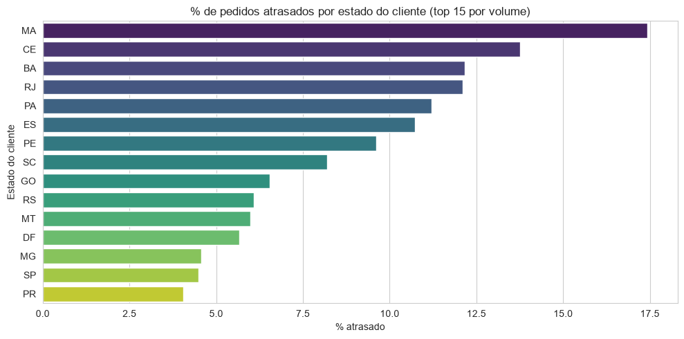
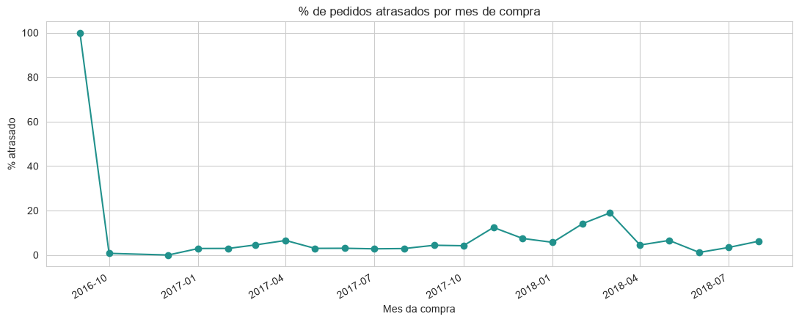
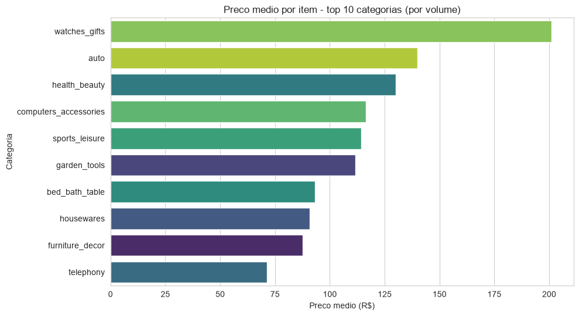
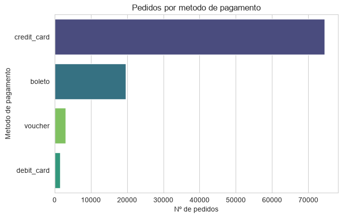

# Olist E-commerce — Análise de Dados

## Problema
O que faz um pedido de e-commerce brasileiro terminar em cliente satisfeito ou insatisfeito? Este projeto investiga o que impacta a satisfação do cliente (nota de review) e o atraso de entrega no maior marketplace do Brasil, e fecha com recomendações práticas para o negócio.

## Dataset
[Brazilian E-Commerce Public Dataset by Olist](https://www.kaggle.com/datasets/olistbr/brazilian-ecommerce) (Kaggle, licença CC BY-NC-SA 4.0 — uso não-comercial, crédito à Olist). ~99k pedidos, 2016-2018, multi-tabela (pedidos, itens, pagamentos, reviews, clientes, vendedores, produtos, geolocalização).

## Método
1. **ETL** (`src/build_analytics_dataset.py`): join das 8 tabelas relevantes no grão de item de pedido, limpeza (dedupe, nulos, tipos de data), cálculo de atraso de entrega. Decisões documentadas em `src/PIPELINE_NOTES.md`.
2. **EDA** (`notebooks/eda_olist.py`): visão geral, satisfação x atraso, atraso por geografia, ticket médio por categoria, método de pagamento.

## Principais resultados
- Atraso de entrega derruba a nota média de review de **4.29 para 2.27** — 62.4% dos pedidos atrasados recebem nota ≤2, contra 9.3% dos pedidos no prazo.
- **6.8%** dos pedidos entregues chegam atrasados; a taxa varia forte por estado (MA chega a 17.4%, quase 3x a média).
- Cliente e vendedor em estados diferentes quase dobra a chance de atraso (**8.0% vs 4.5%**).
- Ticket médio de R$160.61; `credit_card` é o método de pagamento em 75.5% dos pedidos.
- Detalhe completo e recomendações de negócio em [`reports/INSIGHTS.md`](reports/INSIGHTS.md).

## Gráficos
| | |
|---|---|
|  |  |
|  |  |
|  |  |
|  | |

## Como reproduzir
```bash
pip install -r requirements.txt
python data/download.py               # baixa o dataset via kagglehub (público, sem API key)
python src/build_analytics_dataset.py # gera data/processed/olist_analytics.parquet
python notebooks/eda_olist.py         # gera os gráficos em reports/ e imprime os insights
```

## Stack
Python, pandas, pyarrow, matplotlib, seaborn, kagglehub.

## Escopo
Este projeto é análise de dados pura (EDA + storytelling) — sem modelagem preditiva/ML e sem dashboard BI. Recorte de escopo intencional, não limitação.
